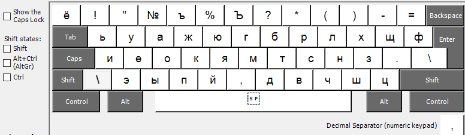
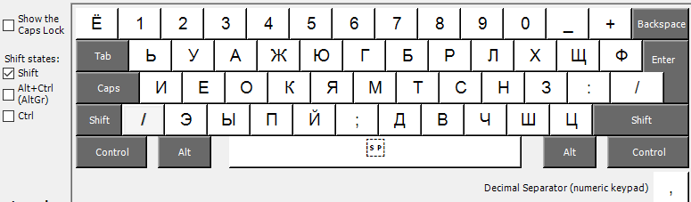
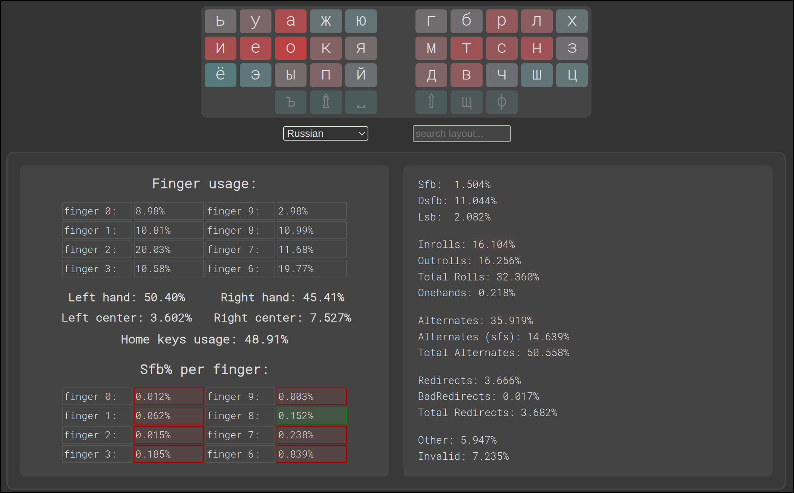
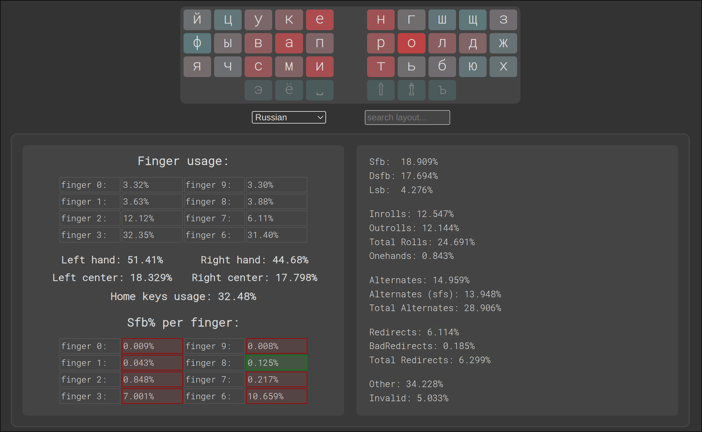
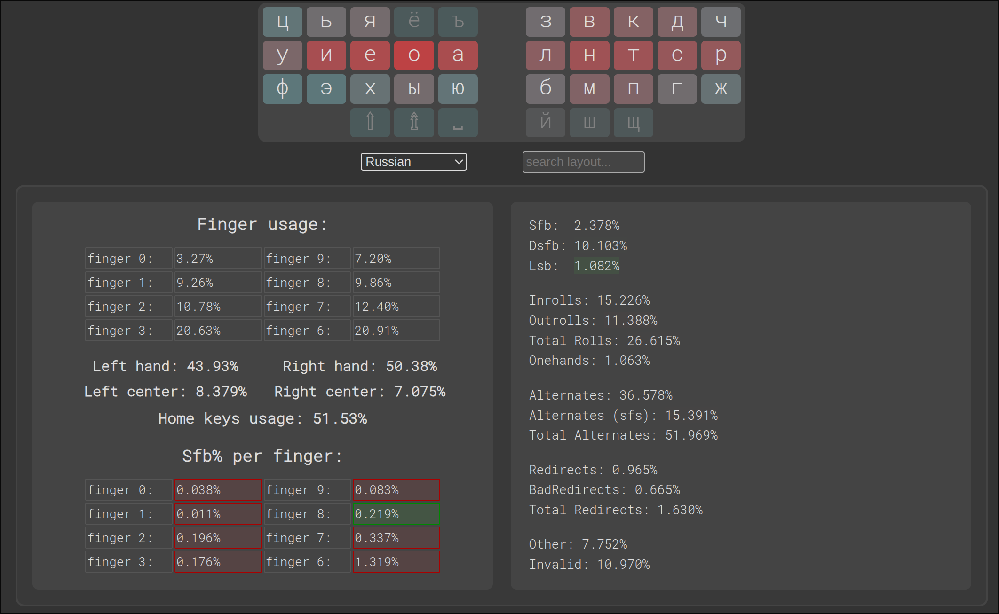
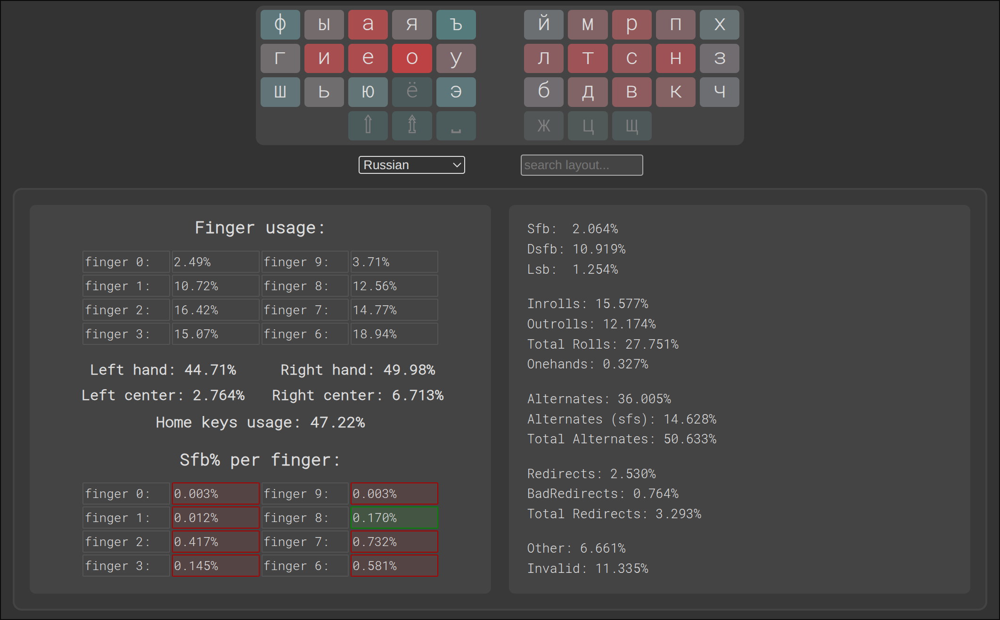
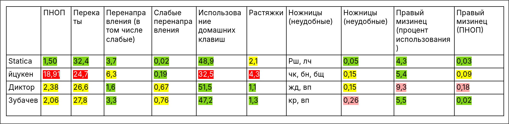

# Statica
Statica - это удобная раскладка для набора по статичиским зонам (это когда за каждым пальцем закреплены определенные клавиши) на русском языке на стандартной клавиатуре.

## ВАЖНО!!!
Буква `п` нажимается указательным пальцем, `ы` – средним, `э` – безымянным (так называемый Angle Mod). Если нажимать по другому, то параметры раскладки ухудшатся.

### С шифтом:

## Параметры, по которым проходила оптимизация при создании раскладки:
- ПНОП (последовательные нажатия одним пальцем). Снижал ПНОП - это необходимо для того, чтобы уйти от набора по динамическим зонам и набирать сочетания букв либо перекатами, либо чередованием рук.
- Перекаты. Увеличивал количество перекатов и ставил самые частые из них на самые удобные места.
- Тепловая карта нажатий. Располагал самые частые буквы на наиболее удобных местах.
- Перенаправления набора (в том числе слабые - в наборе которых не задействован указательный палец; например - `люб` в стандартной раскладке). Снижал количиство перенаправлений (особенно слабых).
- Неудобные ножницы (удобные ножницы - это когда набор биграммы происходит указательным пальцем на нижнем ряду, а средним в верхнем; все остальные ножницы - неудобные) . Минимизировал количество неудобных ножниц (например, `бщ` в стандартной раскладке).
- Растяжки. Минимизировал количество растяжек (например `пу`, `ве` в стандартной раскладке).
- Нагрузка на правый мизинец. Минимизировал нагрузку на правый мизинец, т.к. он при наборе по статическим зонам отвечает за большое количество клавиш - пять букв, точка, шифт, ввод, бекспейс, ноль и две клавиши справа от ноля. 

Для тех, кто хочет глубоко погрузится в раскладкостроение - вот [ссылка](https://docs.google.com/document/d/1W0jhfqJI2ueJ2FNseR4YAFpNfsUM-_FlREHbpNGmC2o/edit?tab=t.dg66iecr8la0#heading=h.c9bgu99m6gk6).

  Я постарался сделать раскладку максимально удобной для набора по статическим зонам. Да, это раскладка для статиков, которым не заходит динамика, либо они ей не хотят заморачиваться и тратить много времени на её освоение. Динамики тоже могут её использовать, но динамить там практически нечего и они могут потерять свою квалификацию.

## Основные особенности:

- Раскладка оптимизирована для стандартной клавиатуры со сдвигом рядов.
- Буква `п` нажимается указательным пальцем, `ы` – средним, `э` – безымянным (так называемый Angle Mod). Если нажимать по другому, то параметры раскладки ухудшатся.
- `,` нажимается без шифта левым или правым указательным пальцем в зависимости от ситуации. Это единственная динамическая зона которую я использую в этой раскладке.
- `:` находится на клавише с точкой (и нажимается с шифтом), а `;` вместе с запятой (это интуитивно попятно и легко запоминается).
- Твердый знак располагается на клавише 4.
- Точка располагается на этом месте (а не как в стандартной раскладке) для того, чтобы быть равноудаленной от `з`, `х`, `ц`, `ф`.

## Сравнение с другими раскладками

Теперь рассмотрим парамерты данной раскладки и сравним её с другими раскладками. Для этого есть [сайт](https://oxey.dev/playground/index.html).

### Statica 2.0

### ЙЦУКЕН

### Диктор

### Зубачев

Как вы могли заметить раскладки немного не соответствуют действительности, но точными их сделать не получается (можете сами на сайте попробовать).

### Сравнительная таблица (значения указаны в процентах):

Итак, раскладка Статика превосходит Диктора и Зубачева по ПНОПам (если в Дикторе и Зубачеве учесть `.` и `,`, то ПНОП вырастет до 2,81% и 2,37% соответственно), перекатам. Также очень мало получилось слабых перенаправлений. Слабые перенаправления делают раскладку неудобной и вызывают чувство того, что пальцы заплетаются – этот недостаток выражен очень сильно на стандартной английской раскладке для левой руки (например, при наборе was, sad). После того как я это неудобство английской раскладки заметил и началось моё увлечение альтернативными раскладками.
Количество растяжек гораздо меньше, чем в йцукене и немного больше чем в Дикторе и Зубачеве, но на практике это не напрягает.
Количество неудобных ножниц (удобные ножницы – указательный палец внизу, а средний наверху) получилось значительно меньшим чем у всех прочих раскладок. По этому параметру у Зубачева напрягает `кр`, а у Диктора `жд`.
У Диктора с моей точки зрения перегружен правый мизинец – как большим процентом использования, так и ПНОП.

Вобщем, уже по этой таблице видно, что раскладка превосходит прочие по многим параметрам.

Но есть и другие преимущества, которые в этой таблице не представлены. Рассмотрю их.

#### Неудобные биграммы в Дикторе (помимо указанных в сравнительной таблице):
1. `пр` – очень частая (1,007% - 13 место). Набирать ее на этом месте не то чтобы неудобно, но для такой частой биграммы лучше подобрать более удобное место.
1. `ци` – довольно частая (0,23% - 127 место)
1. `гр` – довольно частая (0,159% - 167 место)
1. `др` – довольно частая (0,151% - 173 место)
   
На их месте в Статике располагаются менее частые биграммы.

#### Неудобные биграммы в Зубачеве (помимо указанных в сравнительной таблице):
1. `ск` – частая (0,623% - 49 место)
1. `чн` – довольно частая (0,146% - 180 место)
1. `жн` – довольно частая (0,143% - 184 место)

На их месте в Статике располагаются менее частые биграммы.

#### Неудобные биграммы в Статике (помимо указанных в сравнительной таблице):
1. `нц` – нечастая (0,066% - 271 место)

Ещё я старался поставить в нижний ряд на место клавиш, которые нажимаются средним, безымянным и мизинцем редкие буквы. Вместо `в`(4,54%) и `п`(2,81%) (у Зубачева и Диктора соответственно) в Статике стоит `ч`(1,44%). Вместо `к`(3,49%) и `г`(1,70%) (у Зубачева и Диктора соответственно) в Статике стоит `ш`(0,73%). Вместо `ч`(1,44%) и `ж`(0,94%) (у Зубачева и Диктора соответственно) в Статике стоит `ц`(0,48%).

На левой руке `ы`, нажимаемая средним пальцем со своими 1,90% проигрывает Зубачеву и Диктору. Но это дискомфорта у меня не вызывает.

На место труднодоступных `н` и `и` (в стандартной раскладке) поставил более редкие `г` и `,`

Для указательных пальцев с моей точки зрения более удобным для нажатия является нижний ряд, чем верхний. Поэтому внизу расположил более частые буквы по сравнению с верхним рядом.

## Установка раскладки

### Windows

Для создания раскладки существует программа [Microsoft Keyboard Layout Creator](https://www.microsoft.com/en-us/download/details.aspx?id=102134). Видео по созданию раскладки - https://www.youtube.com/watch?v=HMDSJfwi0Kc.

Уже готовый klc-файл с раскладкой и инсталлятор (сделаны мной) - [здесь](./windows/Statica20.7z).
Klc-файл можно открыть в программе и подредактировать, а затем из него создать инсталлятор. После инсталляции раскладки лучше перезагрузиться. Даже если вы не будете самостоятельно создавать раскладку - видео все-равно посмотрите, т.к. там указаны и другие шаги, необходимые для использования раскладки.

Для удаления раскладки нужно запустить инсталлятор повторно.

#### Предупреждение:

Инсталлятор создавался и проверялся на Windows 10.

### Mac

### Linux

Добавить содержимое [файла](./Linux/xkb/symbols/ru) в файл - /usr/share/X11/xkb/symbols/ru.
