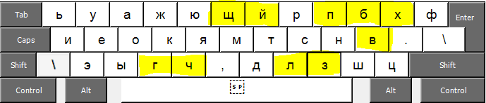
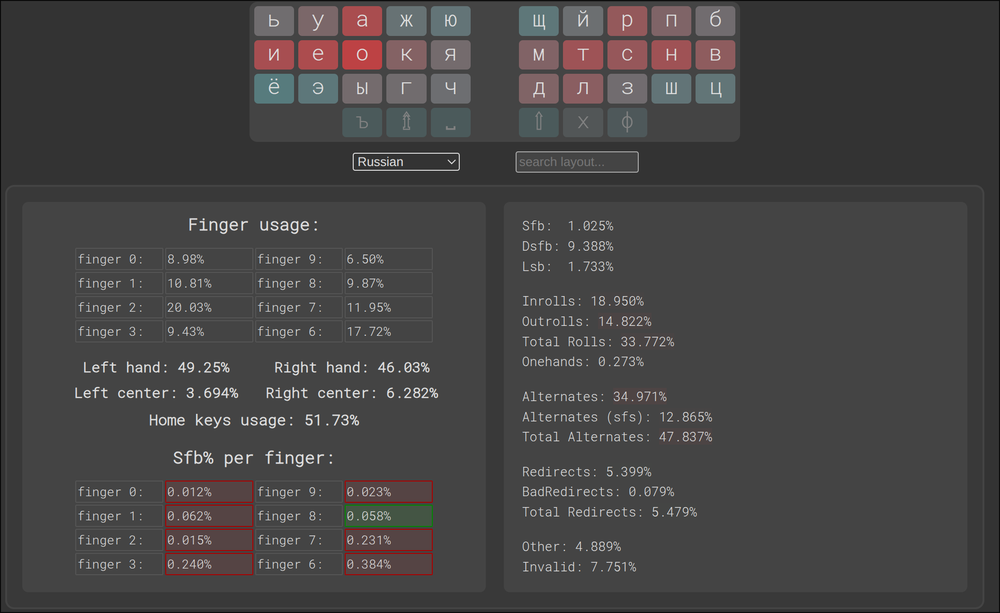
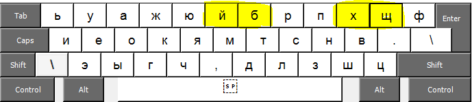

# Statica
Statica - это удобная раскладка для комфортного и быстрого набора по статическим зонам (это когда за каждым пальцем закреплены определенные клавиши) на русском языке на стандартной клавиатуре.

## ВАЖНО!!!
Буква `п` нажимается указательным пальцем, `ы` – средним, `э` – безымянным (так называемый Angle Mod). Если нажимать по другому, то параметры раскладки ухудшатся.

### С шифтом:

## Параметры, по которым проходила оптимизация при создании раскладки:
- ПНОП (последовательные нажатия одним пальцем). Снижал ПНОП - это необходимо для того, чтобы уйти от набора по динамическим зонам и набирать сочетания букв либо перекатами, либо чередованием рук.
- Перекаты. Увеличивал количество перекатов и ставил самые частые из них на самые удобные места.
- Тепловая карта нажатий. Располагал самые частые буквы на наиболее удобных местах.
- Перенаправления набора (в том числе слабые - в наборе которых не задействован указательный палец; например - `люб` в стандартной раскладке). Снижал количиство перенаправлений (особенно слабых).
- Неудобные ножницы (удобные ножницы - это когда набор биграммы происходит указательным пальцем на нижнем ряду, а средним в верхнем; все остальные ножницы - неудобные) . Минимизировал количество неудобных ножниц (например, `бщ` в стандартной раскладке).
- Растяжки. Минимизировал количество растяжек (например `пу`, `ве` в стандартной раскладке).
- Нагрузка на правый мизинец. Минимизировал нагрузку на правый мизинец, т.к. он при наборе по статическим зонам отвечает за большое количество клавиш - пять букв, точка, шифт, ввод, бекспейс, ноль и две клавиши справа от ноля. 

Для тех, кто хочет глубоко погрузится в раскладкостроение - вот [ссылка](https://docs.google.com/document/d/1W0jhfqJI2ueJ2FNseR4YAFpNfsUM-_FlREHbpNGmC2o/edit?tab=t.dg66iecr8la0#heading=h.c9bgu99m6gk6).

  Я постарался сделать раскладку максимально удобной для набора по статическим зонам. Да, это раскладка для статиков, которым не заходит динамика, либо они ей не хотят заморачиваться и тратить много времени на её освоение. Динамики тоже могут её использовать, но динамить там практически нечего и они могут потерять свою квалификацию.

## Основные особенности:

- Раскладка оптимизирована для стандартной клавиатуры со сдвигом рядов.
- Буква `п` нажимается указательным пальцем, `ы` – средним, `э` – безымянным (так называемый Angle Mod). Если нажимать по другому, то параметры раскладки ухудшатся.
- `,` нажимается без шифта левым или правым указательным пальцем в зависимости от ситуации. Это единственная динамическая зона которую я использую в этой раскладке.
- `:` находится на клавише с точкой (и нажимается с шифтом), а `;` вместе с запятой (это интуитивно попятно и легко запоминается).
- Твердый знак располагается на клавише 4 и нажимается средним пальцем.
- Точка располагается на этом месте (а не как в стандартной раскладке) для того, чтобы быть равноудаленной от `з`, `х`, `ц`, `ф`.

## Сравнение с другими раскладками

Теперь рассмотрим парамерты данной раскладки и сравним её с другими раскладками. Для этого есть [сайт](https://oxey.dev/playground/index.html).

### Statica 2.0

### ЙЦУКЕН

### Диктор

### Зубачев

Как вы могли заметить раскладки немного не соответствуют действительности, но точными их сделать не получается (можете сами на сайте попробовать).

### Сравнительная таблица (значения указаны в процентах):

Итак, раскладка Статика превосходит Диктора и Зубачева по ПНОПам (если в Дикторе и Зубачеве учесть `.` и `,`, то ПНОП вырастет до 2,81% и 2,37% соответственно), перекатам. Также очень мало получилось слабых перенаправлений. Слабые перенаправления делают раскладку неудобной и вызывают чувство того, что пальцы заплетаются – этот недостаток выражен очень сильно на стандартной английской раскладке для левой руки (например, при наборе was, sad). После того как я это неудобство английской раскладки заметил и началось моё увлечение альтернативными раскладками.
Количество растяжек гораздо меньше, чем в йцукене и немного больше чем в Дикторе и Зубачеве, но на практике это не напрягает.
Количество неудобных ножниц (удобные ножницы – указательный палец внизу, а средний наверху) получилось значительно меньшим чем у всех прочих раскладок. По этому параметру у Зубачева напрягает `кр`, а у Диктора `жд`.
У Диктора с моей точки зрения перегружен правый мизинец – как большим процентом использования, так и ПНОП.

Вобщем, уже по этой таблице видно, что раскладка превосходит прочие по многим параметрам.

Но есть и другие преимущества, которые в этой таблице не представлены. Рассмотрю их.

#### Неудобные биграммы в Дикторе (помимо указанных в сравнительной таблице):

Не очень удобны перекаты, набираемые мизинцем и средним пальцем. А так же неудобны биграммы набираемые мизинцем и безымянным, если буквы не находятся в одном ряду или  требуется растяжка.

1. `пр` – очень частая (1,007% - 13 место)
2. `тр` – частая (0,486% - 63 место)
3. `чт` – частая (0,321% - 93 место)
4. `ци` – довольно частая (0,23% - 127 место)
5. `кр` – довольно частая (0,227% - 128 место)
6. `гр` – довольно частая (0,159% - 167 место)
7. `др` – довольно частая (0,151% - 173 место)
8. `иц` – довольно частая (0,119% - 211 место)
9. `рт` -  довольно частая (0,117% - 213 место)
10. `це` – довольно частая (0,150% - 174 место)
11. `фи` – нечастая (0,074% - 260 место)
   
На их месте в Статике располагаются менее частые биграммы.

#### Неудобные биграммы в Зубачеве (помимо указанных в сравнительной таблице):

1. `ск` – частая (0,623% - 49 место)
2. `ег` – частая (0,339% - 90 место)
3. `ше` – частая (0,252% - 115 место)
4. `ши` – довольно частая (0,190% - 151 место)
5. `га` – довольно частая (0,185% - 155 место)
6. `чн` – довольно частая (0,146% - 180 место)
7. `жн` – довольно частая (0,143% - 184 место)
8. `зв` – довольно частая (0,129% - 194 место)
9. `аш` – довольно частая (0,122% - 207 место)
10. `ша` – нечастая (0,106% - 223 место)
11. `еш` – нечастая (0,105% - 224 место)
12. `аг` – нечастая (0,101% - 228 место)
13. `ге` – нечастая (0,78% - 253 место)
14. `фи` – нечастая (0,074% - 260 место)
15. `иш` – нечастая (0,069% - 266 место)

На их месте в Статике располагаются менее частые биграммы.

#### Неудобные биграммы в Статике (помимо указанных в сравнительной таблице):
1. `ои` – довольно частая (0,124% - 204 место)
2. `ио` – нечастая (0,091% - 238 место)
3. `иа` – нечастая (0,067% - 270 место)
4. `нц` – нечастая (0,066% - 271 место)

Ещё я старался поставить в нижний ряд на место клавиш, которые нажимаются средним, безымянным и мизинцем редкие буквы. Вместо `в`(4,54%) и `п`(2,81%) (у Зубачева и Диктора соответственно) в Статике стоит `ч`(1,44%). Вместо `к`(3,49%) и `г`(1,70%) (у Зубачева и Диктора соответственно) в Статике стоит `ш`(0,73%). Вместо `ч`(1,44%) и `ж`(0,94%) (у Зубачева и Диктора соответственно) в Статике стоит `ц`(0,48%).

На левой руке `ы`, нажимаемая средним пальцем со своими 1,90% проигрывает Зубачеву и Диктору. Но это дискомфорта у меня не вызывает.

На место труднодоступных `н` и `и` (в стандартной раскладке) поставил более редкие `г` и `,`

Для указательных пальцев с моей точки зрения более удобным для нажатия является нижний ряд, чем верхний. Поэтому внизу расположил более частые буквы по сравнению с верхним рядом.

## Мой опыт использования раскладки

Первый вариант раскладки я начал осваивать 1 июня 2025 года. Вот он:

Желтым маркером отмечены десять букв, которые отличаются от окончательного варианта раскладки. Вот параметры первого варианта раскладки:

ПНОП у первого варианта лучше, чем у окончательного на 0,4%. Так что же меня не устроило? Довольно быстро я заметил, что на левой руке достаточно много перенаправлений набора, которые создавались буквами `к`, `г` и `ч`. Это создавало трудности при наборе слов - `никакого`, `ничего`, `его` и прочих подобных им. Так же довольно трудно было набирать `ого`. Но с этим можно было мириться и я продолжил тренировать этот вариант раскладки.

Когда максимальная скорость начала приближаться к 300 знаков в минуту - я начал замечать перегрузку правого мизинца. Подумал, что проблема решится отправкой `б` на указательный палец, а `щ` отправил на мизинец. Создал второй вариант раскладки:

Через 10 дней я восстановил скорость набора и еще в течении трех недель ее наращивал, но понял, что проблема перегрузки правого мизинца не ушла. Решил ее исправить кардинально - отправил `в` на указательный, а вместо нее на мизинец поставил `з`. Заодно решил проблему перенаправлений на левой руке, поставив `п` на место `г`, а `й` на место `ч`. 

Окончательный вариант:

Перегрузку создавала не частотность буквы `в`, а именно её сочетания с другими буквами, т.к. буква `и` (намного более частая, чем `в`) проблем не вызывала. Перегрузка создавалась биграммами, в которых участвовал мизинец и средний палец - `вс`, `св`, `вр`, `рв`, `зв`, `вз`. Так же ушло с мизинца дольно неприятное сочетание `в.` и неудобная биграмма `вш`.

Количество ПНОП выросло, но неудобств не вызвало, т.к. это увеличение вызвано биграммой `тв` на указательном пальце, которая удобно и быстро набирается. Вывод: при создании раскладки не нужно гнаться за уменьшением ПНОП любой ценой! У меня есть варианты раскладки, у которой ПНОП меньше единицы, но она будет менее удобна, чем данная раскладка.

Перемещение `п` и `в` на указательные пальцы сократило слабые перенаправления практически до нуля и раскладка стала ещё более удобной. Так же снизился ПНОП правого мизинца с 0,130% до 0,030%. С моей точки зрения ПНОП на мизинцах должен стремиться к нулю, т.к. нажимать мизинцем две клавиши подряд очень напряжно.

После этого изменения раскладки мне потребовался уже месяц для того чтобы восстановить скорость, т.к. изменилось положение семи букв суммарной частотностью около 17%. Я тренируюсь на сайте клавогонок - прогресс можно посмотреть здесь:

По словарю [Тексты 0-1 сложность](https://klavogonki.ru/u/#/817942/stats/voc-23329/?fromDate=2025-06-03&toDate=2025-11-24&grouping=day&indicator=speed).

По словарю [Обычный](https://klavogonki.ru/u/#/817942/stats/normal/?fromDate=2025-08-03&toDate=2025-11-24&grouping=day&indicator=speed).

По словарю [Мини-марафон](https://klavogonki.ru/u/#/817942/stats/voc-6018/?fromDate=2025-06-23&toDate=2025-11-24&grouping=day&indicator=speed).

При печати я динамлю только запятую, а в остальном придерживаюсь набора по статическим зонам. Не использую даже скольжения, хотя они и не являются динамикой, если происходят в пределах одной статической зоны.

На данный момент у меня нет каких-либо серьёзных замечаний к раскладке - она получилась очень удобной. Советую попробовать. 

## Установка

### Windows

Для создания раскладки существует программа [Microsoft Keyboard Layout Creator](https://www.microsoft.com/en-us/download/details.aspx?id=102134). Видео по созданию раскладки - https://www.youtube.com/watch?v=HMDSJfwi0Kc.

Уже готовый klc-файл с раскладкой и инсталлятор (сделаны мной) - [здесь](./windows/Statica20.7z).
Klc-файл можно открыть в программе и подредактировать, а затем из него создать инсталлятор. После инсталляции раскладки лучше перезагрузиться. Даже если вы не будете самостоятельно создавать раскладку - видео все-равно посмотрите, т.к. там указаны и другие шаги, необходимые для использования раскладки.

Для удаления раскладки нужно запустить инсталлятор повторно.

#### Предупреждение:

Инсталлятор создавался и проверялся на Windows 10.

### Mac

### Linux

Добавить содержимое [файла](./Linux/xkb/symbols/ru) в файл - /usr/share/X11/xkb/symbols/ru.

#### Предупреждение:

При обновлении системы /usr/share/X11/xkb/symbols/ru может обновится и нужно будет устанавливать раскладку снова.
